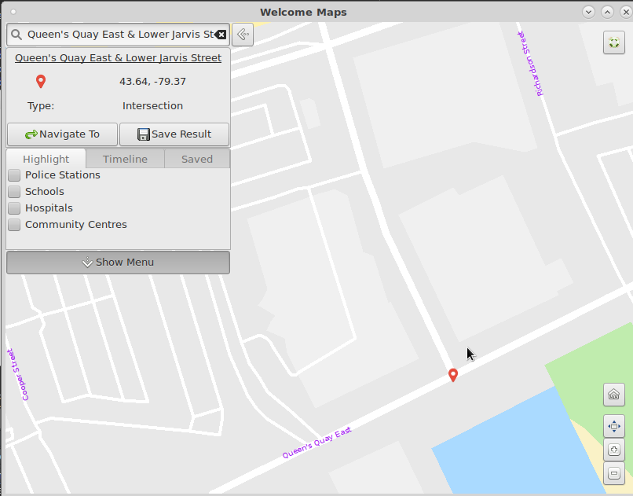
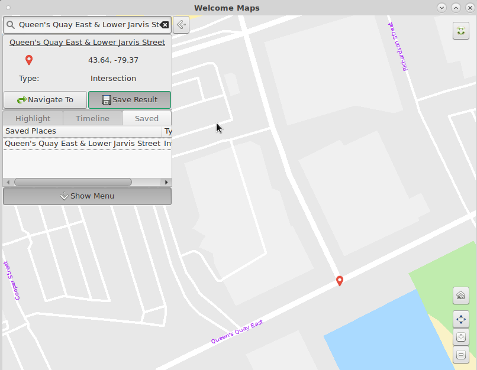
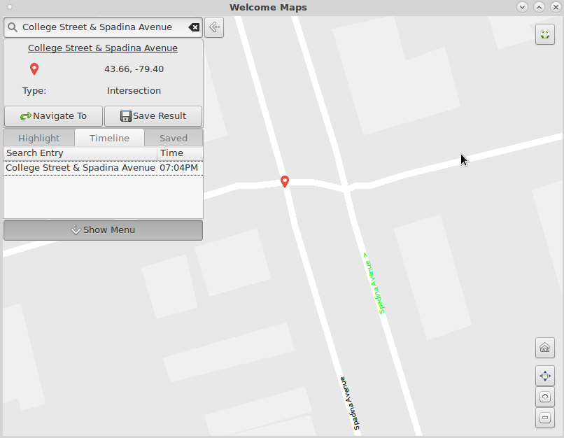
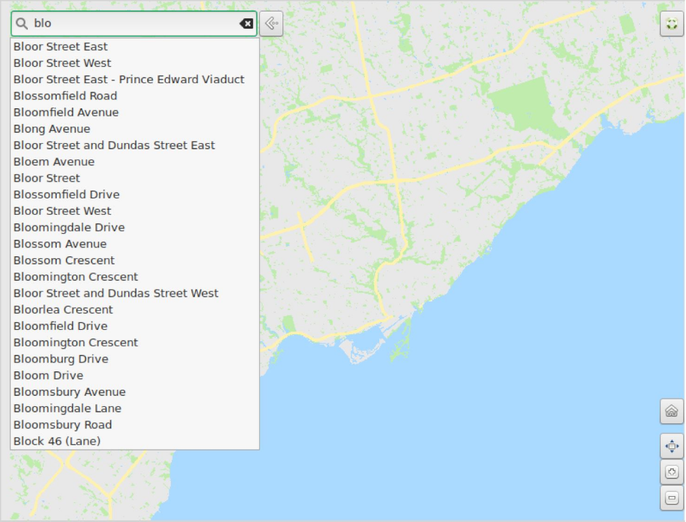
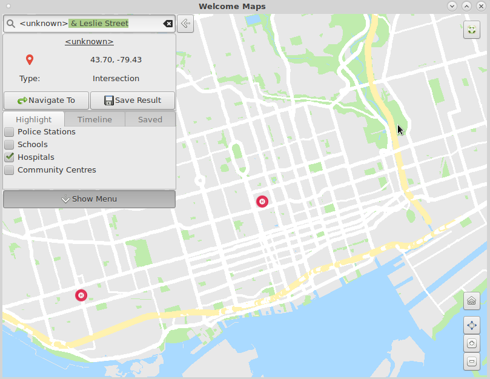
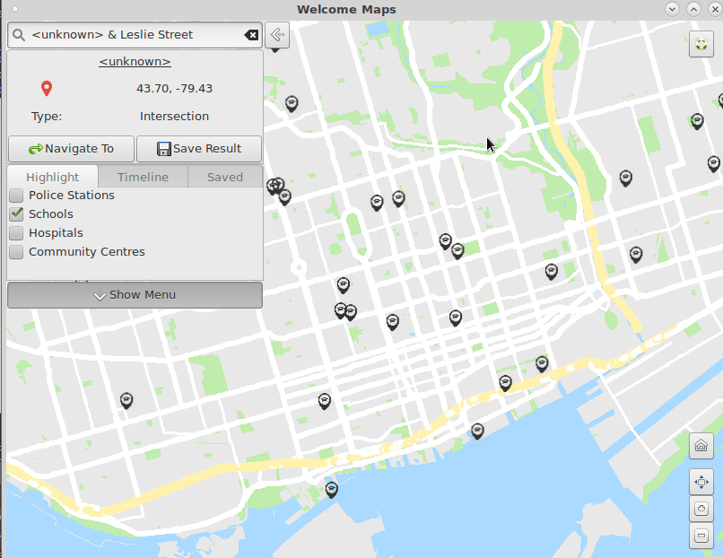
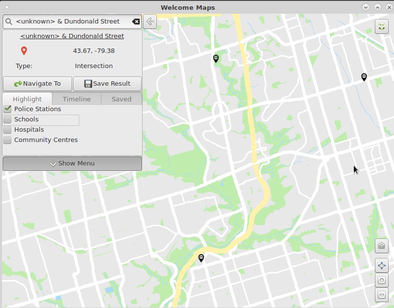
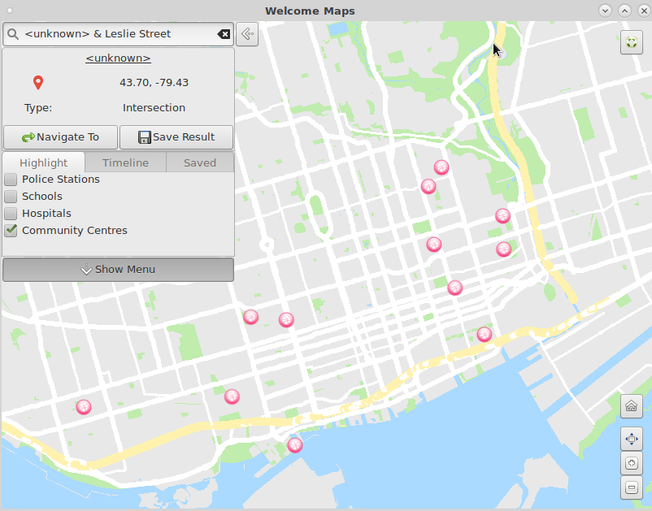

# Welcome Maps

Welcome Maps is specifically designed as a civic tool to allow newcomers to Toronto to discover the resources that matter the most.

To start, you can click on an intersection. 

If you want, you can also save your intersection. 

You can also search for intersections, if you already know the name! 

Our autocomplete makes searching for roads and intersections even faster! 

Furthermore, you can see Points of interest, such as hospitals, schools, police stations and community centers.

You can also press the navigate button to start a directions search!

